# 图床的创建准备工作

[GITHUB地址](https://github.com/Lennonleslie/photo-gallery)

[作者主页](https://lennonleslie.github.io/MyHtml/)

## 创建库

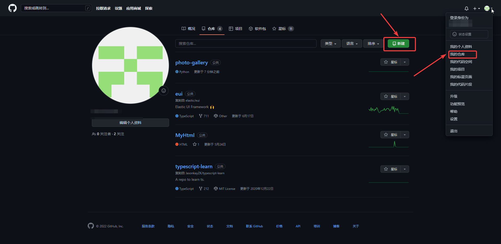

创建信息自行填写。不知道就默认

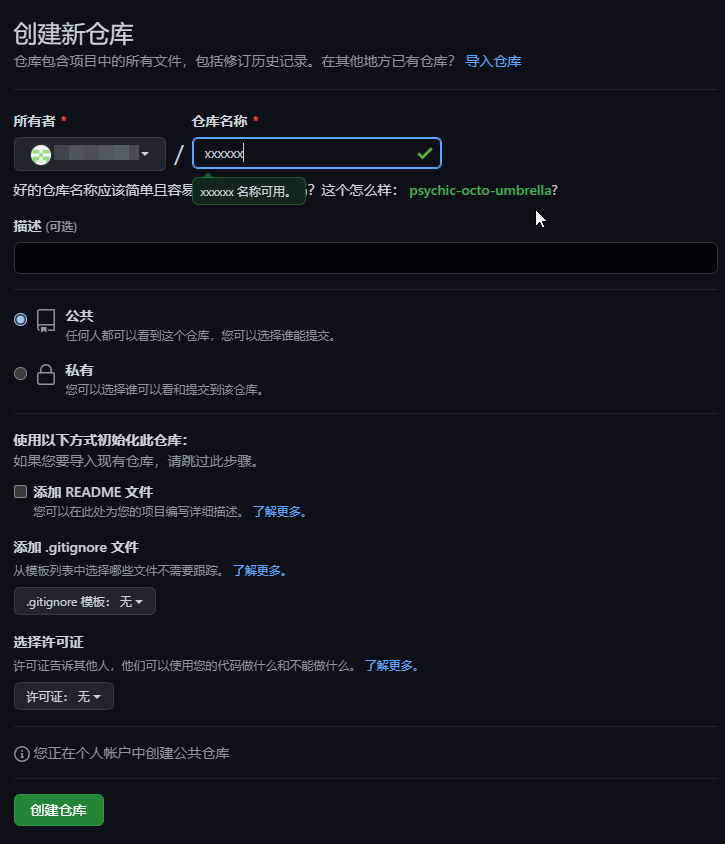 

创建完成后，根据指示，我们随便创建一个文件。里面写什么都行。

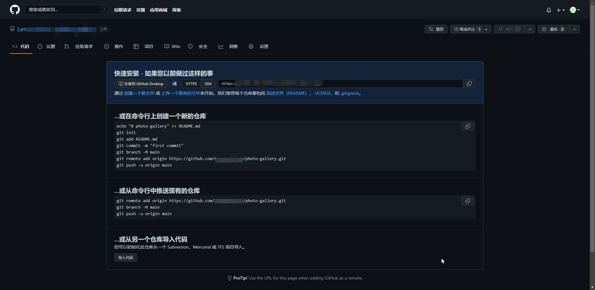

## 克隆库到本地

接着我们打开github的客户端，[下载地址](https://desktop.github.com/])

打开软件

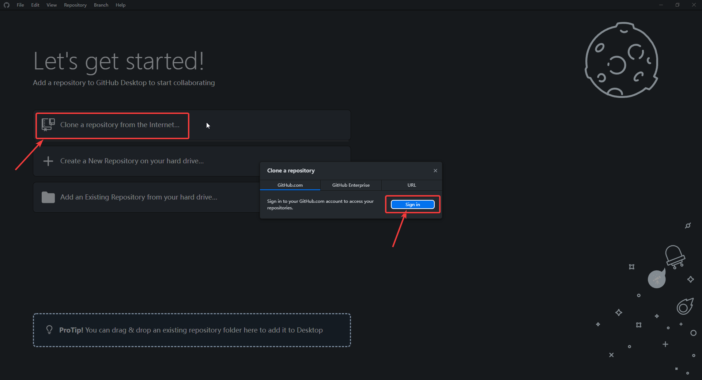

点击克隆，会提示我们需要登录。点击登录。弹出下方提示框，点箭头所指。在经过跳转浏览器读取登录信息后跳转回来。浏览器登陆中就可以直接跳转回来。并且成功登录。

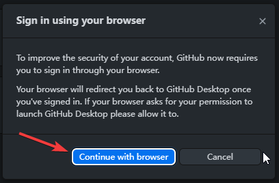

现在进入库的克隆或者其他选项页面

有库的可以直接点击库。没有库的。在网页端在看看吧。

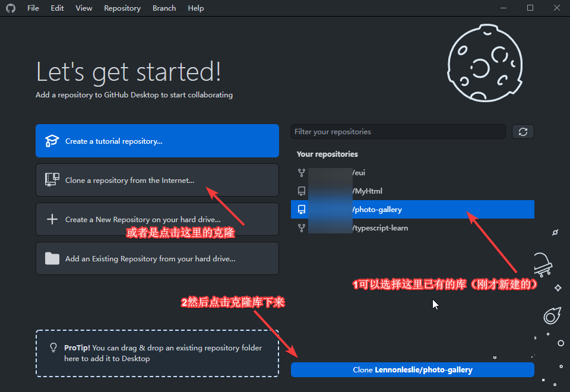

如果选择了左边的克隆，就会弹出下面的窗口，依然是让你克隆相应的库，但是这里有个指定文件位置，这个自己选择。确认之后点击克隆。

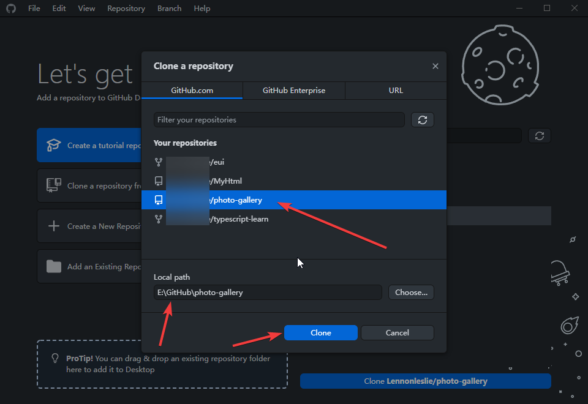

## 具体操作

这样就可以在本地文件夹里，进行新建文件夹及图片文件的传输了。私密东西不建议。

如图下图，自己怎么编辑怎么放东西都可以，放进去就意味着开源。

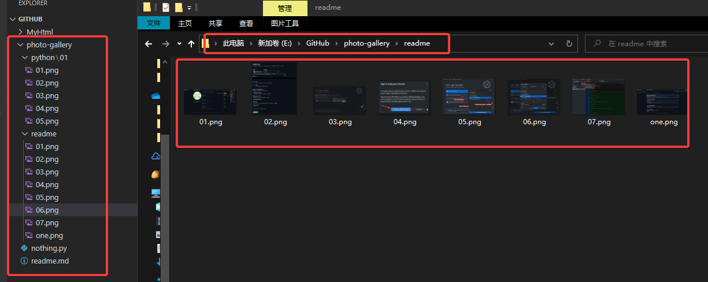

如果这些都操作好了，那么GitHub客户端会检测到改动，你就可以提交确认并且上传上去。

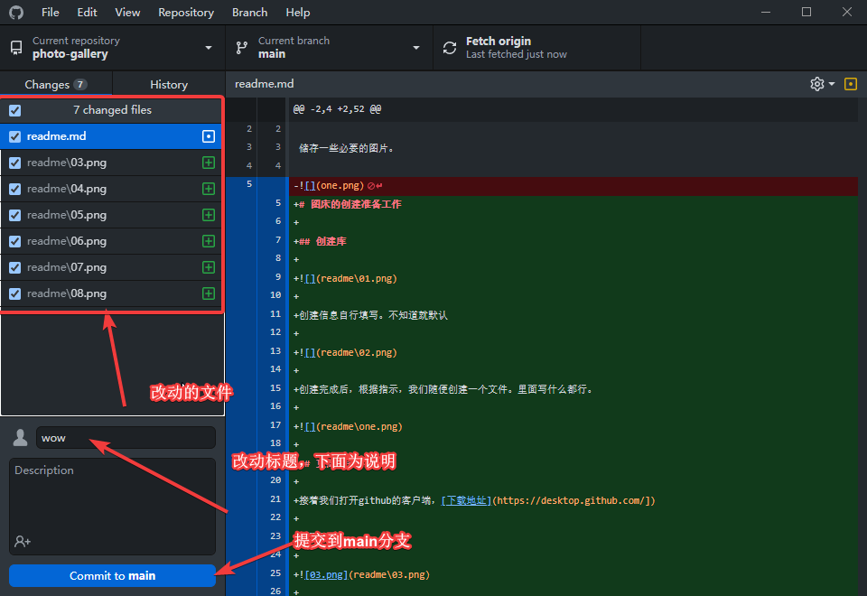

点击`push origin`就可以上传到GitHub了

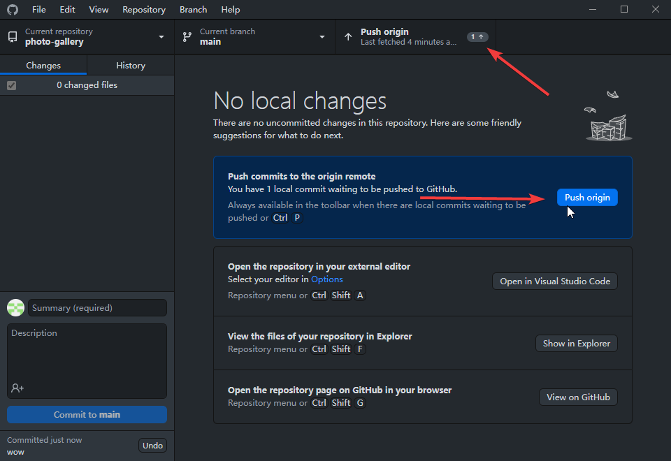

## GitHub图片相对路径

这里可以获取相对路径。

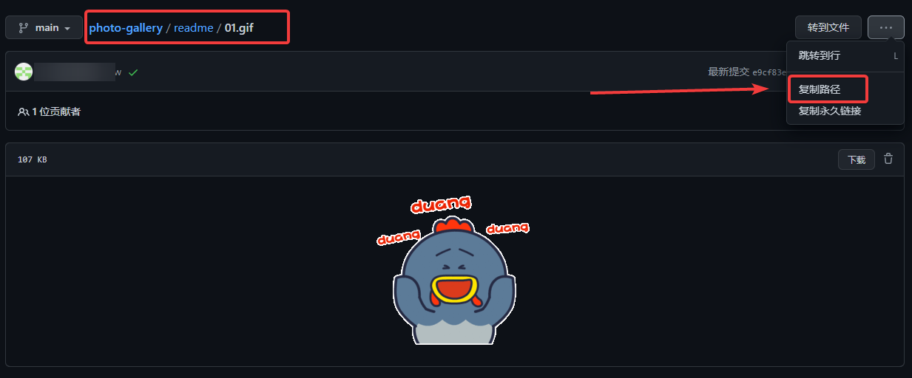

## 外部调用图片路径

在我们的库里面找到上传的图片，按照下图指示，就能够得到这个图片的网络路径。网址即为路径。

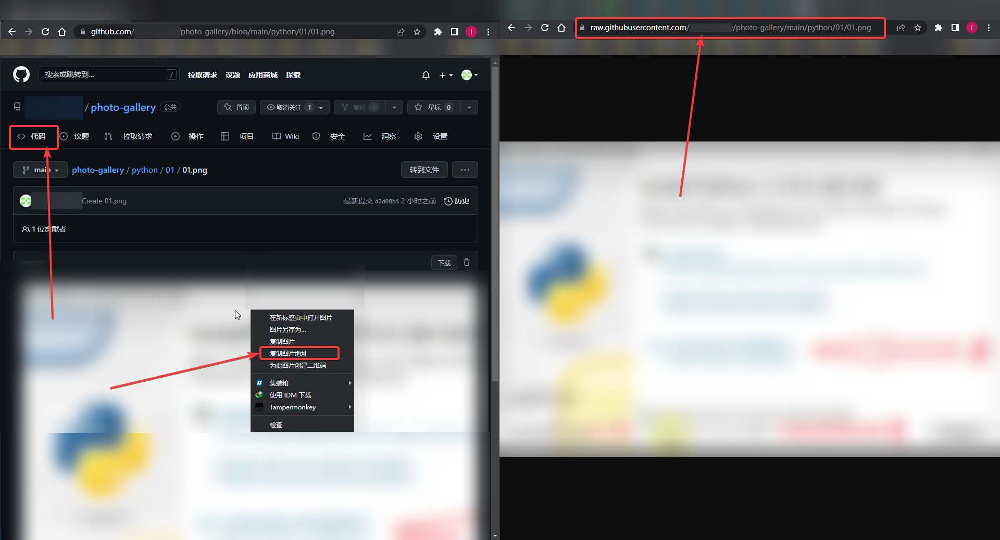

接着，我们就可以通过这种代码来实现我们的Markdown的图片调用了。

## 添加其他库

如果自己还有其他项目就在这个界面，点击add，进行添加新的库，自行尝试。

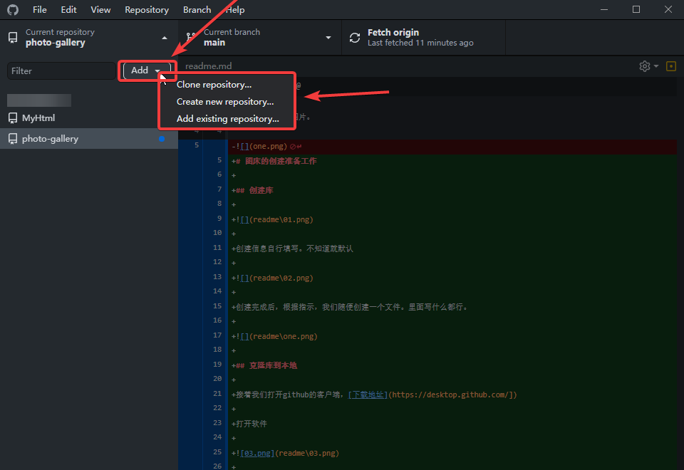
